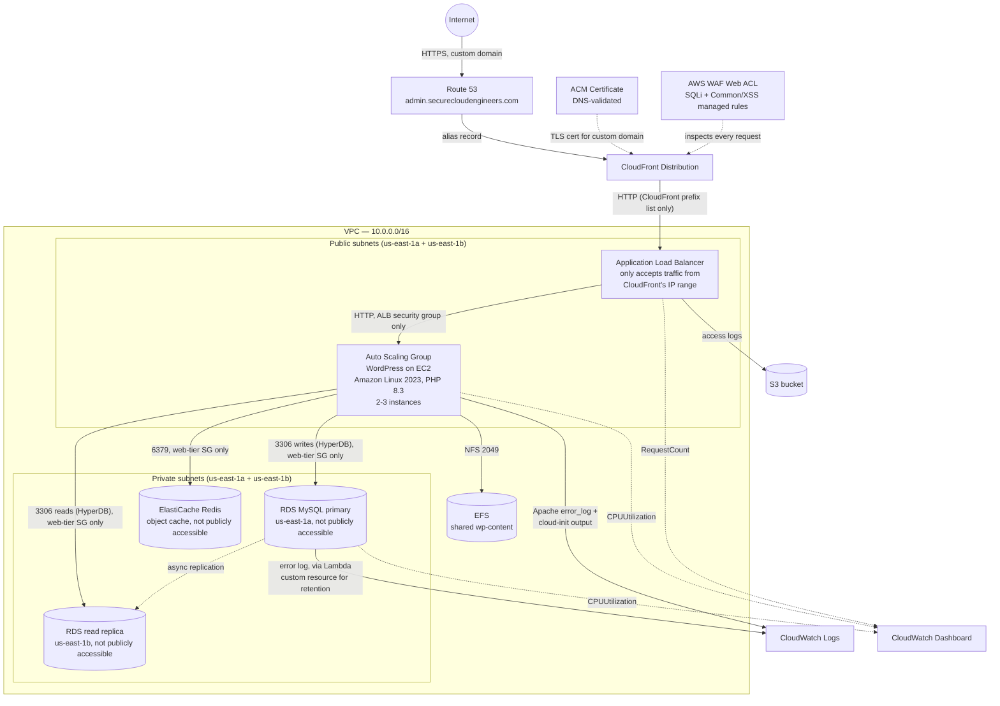
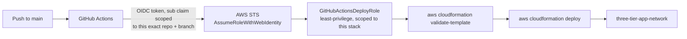

# Three-Tier WordPress on AWS

[](https://github.com/bdahiya2007/three-tier-web-app-aws/actions/workflows/deploy.yml)

A production-style three-tier web architecture on AWS — WordPress running behind CloudFront (on a custom domain, `admin.securecloudengineers.com`, with a DNS-validated ACM certificate) and a dedicated WAF Web ACL, on a horizontally-scaled, self-healing web tier that isn't even reachable except through that edge layer, backed by a database that's never directly reachable, splits reads across a cross-AZ read replica, and is shielded from repeat reads by a Redis object cache, with shared state, full observability, a CI/CD pipeline authenticated via GitHub OIDC (no long-lived AWS credentials), and a documented security review. Not persistently hosted — a public WordPress admin login isn't something worth leaving exposed indefinitely for a demo. Deployable on demand; see [Deploying this yourself](#deploying-this-yourself).

## What this demonstrates

- Designing a three-tier architecture where the data tier (RDS) is never publicly reachable — only the web tier's security group can reach it, on the database port, nothing else
- Making a considered build-vs-reuse call on a pre-existing WAF Web ACL from another project in the same account: identifying that reusing it would create cross-stack ownership conflicts and only covers half the requirement (SQLi, not XSS), then building a dedicated one instead of forcing a reuse that looked convenient but wasn't sound
- Actually closing the bypass a WAF alone doesn't: restricting the ALB's security group to CloudFront's own IP range (an AWS-managed prefix list), since a WAF attached only to CloudFront does nothing if the origin behind it is still directly reachable from the internet
- Adding a custom domain (`admin.securecloudengineers.com`) with a DNS-validated ACM certificate and a Route 53 record into a hosted zone owned by a *different* project's stack — as a new record, not a modification of that zone's existing records, so it doesn't create the same cross-stack ownership conflict a shared WAF Web ACL would have
- Building for horizontal scale and resilience: an Auto Scaling Group (2-3 instances) across two Availability Zones behind an Application Load Balancer, with shared state (EFS) so any instance can serve any request identically
- Read/write splitting with a cross-AZ RDS read replica and the HyperDB drop-in — and *proving* it, not just configuring it: measured live `Com_select` counters to confirm reads actually hit the replica (+399 vs. +1 background noise across 15 requests), then confirmed a real WordPress write succeeds only because it reaches the primary, by separately proving a direct write against the replica fails (`read_only` enforced)
- Adding a Redis object cache (ElastiCache) as a WordPress drop-in (`object-cache.php`) instead of just configuring the connection and hoping — installed the native PhpRedis PHP extension for real performance, and verified `DBSIZE`/key contents directly against Redis after real traffic, not just that the plugin files existed
- Recovering from a real failure end-to-end: restoring RDS from a snapshot after the original stack was deliberately deleted, including the specific quirks of a MySQL snapshot restore (`DBName` rejected by the API, master password never carried over from a snapshot)
- Instrumenting the stack for observability: a CloudWatch dashboard (EC2/RDS CPU, ALB request count) plus a full logging pipeline — ALB access logs to S3, instance and RDS logs to CloudWatch Logs — with cost-conscious, centrally-configured retention
- Solving a CloudFormation/RDS ownership conflict (RDS auto-creates its own log group; a plain `AWS::Logs::LogGroup` resource would race it) with a small Lambda-backed custom resource, instead of reaching for a workaround that risks replacing the live database
- Replacing long-lived AWS credentials with GitHub OIDC role assumption — including tracking down the real cause of a failed `AssumeRoleWithWebIdentity` call via CloudTrail (GitHub's `sub` claim embeds immutable numeric org/repo IDs, not just names)
- Writing a least-privilege IAM policy for the CI role: scoped to this stack's specific resource ARNs wherever AWS's IAM model supports it, and to a tight action list (not `service:*`) where it doesn't
- Running a security architect review that found and fixed a real input-validation gap (see [Security review](#security-review) below) rather than declaring victory once the feature merely deployed without errors
- Enforcing the branch/PR policy at the platform level, not just by convention: a branch protection rule on `main` rejects direct pushes outright and requires the CI lint check to pass and the branch to be up to date before merge is even possible — configured to still let a solo maintainer merge their own reviewed PRs (`required_approving_review_count: 0`) rather than accidentally locking the repo owner out
- Documenting every failure encountered as it happened — root cause and fix, not just the happy path — in [Deployment.md](Deployment.md)

## Architecture





## Why this architecture

| Decision | Reasoning |
|---|---|
| RDS in private subnets, `PubliclyAccessible: false`, security group only accepts 3306 from the web tier's security group | The database is never directly reachable from the internet — only the WordPress instances can reach it, and only on the DB port |
| WordPress instances live in **public** subnets (no NAT Gateway) | Avoids the recurring cost of a NAT Gateway for a portfolio project, while `WebServerSecurityGroup` still only accepts HTTP from the ALB's security group, not the internet directly — the only direct path in is SSH, gated by `SSHLocationCidr` |
| A second private *and* second public subnet, in a second AZ | RDS requires a DB subnet group spanning ≥2 AZs even for a single-AZ instance; the ALB and Auto Scaling Group then reuse that same second AZ's public subnet for genuine multi-AZ availability, instead of adding a third subnet just to satisfy RDS |
| EFS mounted at `wp-content` only, not the whole webroot | WordPress core files are cheap to reinstall per-instance from the official tarball at boot; only `wp-content` (themes/plugins/uploads) needs to be shared across instances, so only that path depends on network storage |
| First-boot EFS seeding is conditional (copies local `wp-content` to EFS only if EFS is still empty) | The same `UserData` script has to be correct whether an instance is the very first one ever, or the fifth replacement joining an already-populated Auto Scaling Group |
| RDS log retention set via a Lambda-backed custom resource, not a plain `AWS::Logs::LogGroup` | RDS auto-creates its own log group when `EnableCloudwatchLogsExports` is set; a CloudFormation-managed log group with the same name would race it and fail with "already exists." The alternative — giving `DBInstance` an explicit `DBInstanceIdentifier` so the log group's name could be known in advance — is an immutable, replacement-triggering property; not worth risking the live database over log retention |
| GitHub Actions authenticates via OIDC role assumption, not access keys | No long-lived AWS credentials stored in GitHub at all. The trust policy checks the token's `sub` claim — including GitHub's immutable numeric org/repo IDs, not just the names — against this exact repository and branch |
| CI role's IAM policy: tight action lists on `Resource: "*"` for most infrastructure services, ARN-scoped for IAM, S3, and Route 53 | Most EC2/RDS/ELB/EFS/Lambda create-and-describe actions don't support resource-level ARN restriction in AWS's own IAM model — scope is enforced via the action list instead. Route 53 record actions *do* support it, so the policy restricts them to just the one hosted zone this stack adds a record into, not every zone in the account. IAM permissions are the tightest of all, since over-broad IAM permissions on a CI role is a privilege-escalation risk |
| Snapshot restore is parameter-driven (`DBSnapshotIdentifier`), not a separate template | The same template can either create a fresh database or restore a prior one, decided at deploy time — used for real after the stack was deliberately deleted and needed its WordPress content back |
| A new, dedicated WAF Web ACL, not the one already in this account from another project | The existing ACL only covers SQLi (not XSS) and is owned by an independent CloudFormation stack — importing or modifying it would mean two unrelated stacks fighting over its rule list on every future update, and would couple this project's security posture to an unrelated site's |
| ALB security group restricted to CloudFront's IP range (AWS-managed prefix list), not `0.0.0.0/0` | A WAF attached only to CloudFront protects nothing if the origin behind it is still directly reachable — this is what actually makes the WAF's protection real instead of bypassable |
| `SizeRestrictions_BODY` overridden to `Count`, paired with raising the Web ACL's body inspection limit to 64 KB | The managed rule's hardcoded 8 KB threshold was blocking real WordPress posts, not just attacks — it has no content awareness and no tunable size. Countering it alone would leave the actual SQLi/XSS rules blind past the first 8 KB of any request; raising the inspection limit alongside it keeps full-body detection intact while fixing the false positive |
| Custom domain's Route 53 record added into an existing hosted zone owned by a different stack, rather than that zone being imported/owned here | `AWS::Route53::RecordSet` is its own independent resource, unlike a Web ACL's `Rules` list — adding one new record doesn't create the "whole list is authoritative" conflict a shared WAF ACL would, so there's no reason to duplicate or migrate the zone itself just to add one subdomain |
| CloudFront caching disabled (`CachingDisabled` + `AllViewerAndCloudFrontHeaders-2022-06` policies) rather than enabled by default | WordPress is a dynamic, session-aware application; caching GET responses at the edge risks serving one visitor's logged-in page to another. CloudFront here is a TLS-termination + WAF-enforcement layer, not a performance cache — real caching for static paths would be a deliberate follow-up, not a default |
| Origin request policy forwards CloudFront's own `CloudFront-*` headers, not just viewer headers | With an HTTP-only ALB origin, the ALB's own `X-Forwarded-Proto` always reads `http` (it reflects the CloudFront-to-ALB hop, not what the viewer actually used), which sent WordPress into an infinite redirect loop on `/wp-admin`. `CloudFront-Forwarded-Proto` carries the viewer's real protocol, but only reaches the origin if the origin request policy explicitly opts into CloudFront's headers — plain `AllViewer` doesn't |
| Read replica placed via an explicit `AvailabilityZone`, reusing the same security group as the primary | A different AZ than the primary gives it independent power/network/hardware fault domains; sharing the primary's security group is a deliberate simplification since both serve the identical consumer (the web tier) with the identical access pattern — no reason to duplicate the rule set |
| Read/write splitting via HyperDB (a WordPress drop-in) rather than at the infrastructure layer (e.g. a proxy) | WordPress core has no native concept of a read replica — every query goes wherever `DB_HOST` points. HyperDB intercepts at the `wpdb` layer instead, which is the standard, Automattic-maintained way to do this for WordPress specifically, rather than introducing a separate proxy component (e.g. ProxySQL) this project doesn't otherwise need |
| Redis object cache via a drop-in (`object-cache.php`), same mechanism as HyperDB | WordPress has no built-in persistent object cache. A drop-in is what the plugin's own "Enable Object Cache" button does, just automated in `UserData` — no wp-admin click required at boot. Single-node, no Multi-AZ: cache data is disposable (rebuilt from RDS on the next read), so there's nothing worth the extra cost or complexity of protecting through a node failure |
| Native PhpRedis PHP extension installed, not left to the plugin's bundled pure-PHP Predis fallback | The plugin works either way, but PhpRedis is meaningfully faster — checked that Amazon Linux 2023's `php8.3-pecl-redis6` package actually exists before assuming it, rather than guessing at a package name |
| `DBPassword`'s `AllowedPattern` excludes `'` and `\`, not just `/`, `@`, `"`, and whitespace | Found during a security review: `db-config.php` embeds the password inside a single-quoted PHP string literal, so an unescaped `'` in a chosen password would cause a fatal PHP parse error on every instance boot — a self-inflicted outage from an otherwise-valid password. The older `wp-config.php` `sed` substitution wasn't vulnerable to this specific character |

## Security review

Adding the RDS read replica was followed by a dedicated security/architecture review — auditing both the CloudFormation code and the live deployed state, then proving behavior empirically rather than trusting that "it deployed without errors" means "it works correctly."

**Verified, with evidence, not just configuration:**
- Replica confirmed in a different AZ than the primary; both instances `PubliclyAccessible: false`; both DB subnets' route tables have only a local VPC route — no gateway path at all, confirmed at the routing layer, not just the API flag
- Security group scoped to TCP 3306 from the web tier's security group only, shared correctly by both instances
- **Reads actually reach the replica**: measured `SHOW GLOBAL STATUS` `Com_select` before/after 15 page loads — replica +399, primary +1 (background noise)
- **Writes actually reach the primary**: ran a real `$wpdb->query()` INSERT through the live HyperDB code path (succeeded, no error), then separately confirmed a *direct* write attempt against the replica fails outright (`read_only` enforced) — proving the first write couldn't have landed there
- The replica's `read_only` enforcement acts as a fail-safe independent of HyperDB's own config: even a HyperDB misconfiguration couldn't cause a silent write to the replica; it would error loudly instead

**Found and fixed**: `DBPassword`'s `AllowedPattern` didn't exclude `'` or `\`, which could break `db-config.php`'s PHP string literal and take the site down on a future password rotation — see the table above.

**Found, not yet fixed (flagged for a deliberate decision, not an oversight)**:
- Neither RDS instance is encrypted at rest. This predates the replica, but a replica must match its source's encryption status, so the gap is now on two instances instead of one. Remediation requires snapshot → restore-as-encrypted for the primary (a new endpoint, genuinely disruptive) before the replica could be recreated encrypted too.
- No TLS enforcement in transit between WordPress and RDS (`require_secure_transport` unset). Partially mitigated by VPC-level network isolation, but doesn't meet defense-in-depth for data-in-transit on its own.

Full methodology (exact commands, the counter values, the `read_only` proof) is in [Deployment.md](Deployment.md#rds-read-replica-and-wordpress-readwrite-splitting).

## Repository structure

```
.
├── cloudformation/
│   └── vpc.yaml                  # VPC, ALB + Auto Scaling Group, RDS primary + read replica, EFS,
│                                  # CloudWatch dashboard, logging (S3 + CloudWatch Logs), GitHub OIDC deploy role
├── terraform/                    # Earlier, simpler baseline (see note below) — not feature-equivalent
├── .github/workflows/deploy.yml  # CI/CD: GitHub OIDC authentication, deploy on push to main
├── Deployment.md                 # Full deployment guide, every parameter, and an extensive
│                                  # troubleshooting log of every real failure hit building this
└── .gitignore
```

### A note on the `terraform/` directory

It's an earlier, deliberately simpler snapshot of this project — a VPC, a single EC2 instance, and RDS — predating the Auto Scaling Group, ALB, EFS, CloudWatch dashboard, logging, and CI/CD that the CloudFormation template now has. It's included to show the same core network/database pattern in a second tool, not as a feature-equivalent alternative deployment path. See [terraform/README.md](terraform/README.md) for its own scope and deployment instructions.

## CI/CD pipeline

Two separate workflows, split by trigger — each with its own concurrency scope, so a PR's lint check never has to queue behind an in-progress production deploy:

- [`.github/workflows/validate.yml`](.github/workflows/validate.yml) — every pull request targeting `main`. Lints the CloudFormation template with `cfn-lint`. No AWS credentials at all.
- [`.github/workflows/deploy.yml`](.github/workflows/deploy.yml) — every push to `main` (i.e. after a PR merges). Requests a short-lived GitHub OIDC token, assumes `GitHubActionsDeployRole` (no `AWS_ACCESS_KEY_ID`/`AWS_SECRET_ACCESS_KEY` anywhere in this repo), validates and deploys the stack (`DBPassword`/`KeyPairName` from GitHub Secrets, every other parameter keeps its current value), then prints the stack outputs.

Merging into `main` is the actual gate, and it's enforced by a **branch protection rule**, not just convention: direct pushes to `main` are rejected outright, the `validate` check must pass before merge is even possible, and the branch must be up to date with `main` first — the last one specifically closes a real gap this project hit once already (two PRs merging out of order, based on a `main` that had already moved, produced a conflict that also silently stopped CI from re-triggering on the second PR until it was rebased).

Getting the OIDC piece working for real surfaced two failures worth calling out: the trust policy initially checked the `sub` claim in the wrong format (missing GitHub's immutable numeric org/repo IDs — found by reading the actual denied request out of CloudTrail, since workflow logs never show token contents), and the IAM policy was initially missing `cloudformation:GetTemplateSummary`, a permission `aws cloudformation deploy` needs internally that isn't part of the change-set API surface its name suggests. Both — plus the full branch protection configuration and the cfn-lint findings hit along the way — are documented in detail, with the exact diagnostic commands used, in [Deployment.md](Deployment.md#troubleshooting).

## Deploying this yourself

See [Deployment.md](Deployment.md) for the full guide — every parameter, the GitHub Actions/OIDC one-time setup, connecting to the database, viewing logs and the dashboard, and the full troubleshooting log. Quick version:

```bash
aws cloudformation deploy \
  --template-file cloudformation/vpc.yaml \
  --stack-name three-tier-app-network \
  --region us-east-1 \
  --capabilities CAPABILITY_NAMED_IAM \
  --parameter-overrides \
    DBPassword=<your-db-password> \
    KeyPairName=<your-existing-ec2-key-pair-name>
```

## Tech stack

AWS CloudFormation · Amazon CloudFront · AWS WAF (managed rule groups) · Amazon Route 53 · AWS Certificate Manager (DNS validation) · Amazon VPC · Amazon EC2 (Auto Scaling, Launch Templates) · Elastic Load Balancing (Application Load Balancer) · Amazon RDS (MySQL, read replica) · HyperDB (WordPress read/write DB splitting) · Amazon ElastiCache (Redis) · Redis Object Cache (WordPress drop-in) · Amazon EFS · AWS Lambda (custom resource) · Amazon CloudWatch (Dashboards, Logs) · AWS IAM (OIDC federation) · Amazon S3 · Amazon Linux 2023 · PHP 8.3 · Apache · WordPress · Terraform (baseline alternate path) · GitHub Actions
