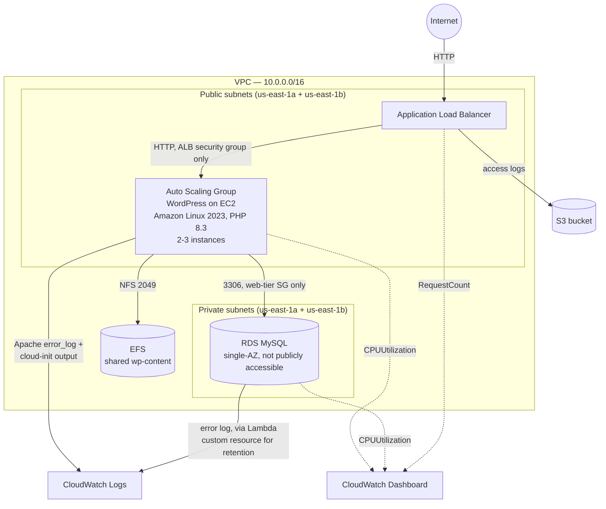
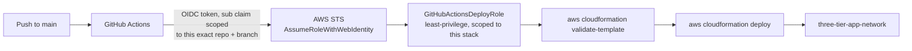

# Three-Tier WordPress on AWS

[](https://github.com/bdahiya2007/three-tier-web-app-aws/actions/workflows/deploy.yml)

A production-style three-tier web architecture on AWS — WordPress running on a horizontally-scaled, self-healing web tier, backed by a database that's never directly reachable, with shared state, full observability, and a CI/CD pipeline authenticated via GitHub OIDC (no long-lived AWS credentials). Not persistently hosted at a public URL — the ALB's DNS name isn't stable across a stack teardown/recreate, and a public WordPress admin login isn't something worth leaving exposed indefinitely for a demo. Deployable on demand; see [Deploying this yourself](#deploying-this-yourself).

## What this demonstrates

- Designing a three-tier architecture where the data tier (RDS) is never publicly reachable — only the web tier's security group can reach it, on the database port, nothing else
- Building for horizontal scale and resilience: an Auto Scaling Group (2-3 instances) across two Availability Zones behind an Application Load Balancer, with shared state (EFS) so any instance can serve any request identically
- Recovering from a real failure end-to-end: restoring RDS from a snapshot after the original stack was deliberately deleted, including the specific quirks of a MySQL snapshot restore (`DBName` rejected by the API, master password never carried over from a snapshot)
- Instrumenting the stack for observability: a CloudWatch dashboard (EC2/RDS CPU, ALB request count) plus a full logging pipeline — ALB access logs to S3, instance and RDS logs to CloudWatch Logs — with cost-conscious, centrally-configured retention
- Solving a CloudFormation/RDS ownership conflict (RDS auto-creates its own log group; a plain `AWS::Logs::LogGroup` resource would race it) with a small Lambda-backed custom resource, instead of reaching for a workaround that risks replacing the live database
- Replacing long-lived AWS credentials with GitHub OIDC role assumption — including tracking down the real cause of a failed `AssumeRoleWithWebIdentity` call via CloudTrail (GitHub's `sub` claim embeds immutable numeric org/repo IDs, not just names)
- Writing a least-privilege IAM policy for the CI role: scoped to this stack's specific resource ARNs wherever AWS's IAM model supports it, and to a tight action list (not `service:*`) where it doesn't
- Documenting every failure encountered as it happened — root cause and fix, not just the happy path — in [Deployment.md](Deployment.md)

## Architecture





## Why this architecture

| Decision | Reasoning |
|---|---|
| RDS in private subnets, `PubliclyAccessible: false`, security group only accepts 3306 from the web tier's security group | The database is never directly reachable from the internet — only the WordPress instances can reach it, and only on the DB port |
| WordPress instances live in **public** subnets (no NAT Gateway) | Avoids the recurring cost of a NAT Gateway for a portfolio project, while `WebServerSecurityGroup` still only accepts HTTP from the ALB's security group, not the internet directly — the only direct path in is SSH, gated by `SSHLocationCidr` |
| A second private *and* second public subnet, in a second AZ | RDS requires a DB subnet group spanning ≥2 AZs even for a single-AZ instance; the ALB and Auto Scaling Group then reuse that same second AZ's public subnet for genuine multi-AZ availability, instead of adding a third subnet just to satisfy RDS |
| EFS mounted at `wp-content` only, not the whole webroot | WordPress core files are cheap to reinstall per-instance from the official tarball at boot; only `wp-content` (themes/plugins/uploads) needs to be shared across instances, so only that path depends on network storage |
| First-boot EFS seeding is conditional (copies local `wp-content` to EFS only if EFS is still empty) | The same `UserData` script has to be correct whether an instance is the very first one ever, or the fifth replacement joining an already-populated Auto Scaling Group |
| RDS log retention set via a Lambda-backed custom resource, not a plain `AWS::Logs::LogGroup` | RDS auto-creates its own log group when `EnableCloudwatchLogsExports` is set; a CloudFormation-managed log group with the same name would race it and fail with "already exists." The alternative — giving `DBInstance` an explicit `DBInstanceIdentifier` so the log group's name could be known in advance — is an immutable, replacement-triggering property; not worth risking the live database over log retention |
| GitHub Actions authenticates via OIDC role assumption, not access keys | No long-lived AWS credentials stored in GitHub at all. The trust policy checks the token's `sub` claim — including GitHub's immutable numeric org/repo IDs, not just the names — against this exact repository and branch |
| CI role's IAM policy: tight action lists on `Resource: "*"` for most infrastructure services, ARN-scoped for IAM and S3 | Most EC2/RDS/ELB/EFS/Lambda create-and-describe actions don't support resource-level ARN restriction in AWS's own IAM model — scope is enforced via the action list instead. IAM permissions are the tightest of all, since over-broad IAM permissions on a CI role is a privilege-escalation risk |
| Snapshot restore is parameter-driven (`DBSnapshotIdentifier`), not a separate template | The same template can either create a fresh database or restore a prior one, decided at deploy time — used for real after the stack was deliberately deleted and needed its WordPress content back |

## Repository structure

```
.
├── cloudformation/
│   └── vpc.yaml                  # VPC, ALB + Auto Scaling Group, RDS, EFS, CloudWatch dashboard,
│                                  # logging (S3 + CloudWatch Logs), GitHub OIDC deploy role
├── terraform/                    # Earlier, simpler baseline (see note below) — not feature-equivalent
├── .github/workflows/deploy.yml  # CI/CD: GitHub OIDC authentication, deploy on push to main
├── Deployment.md                 # Full deployment guide, every parameter, and an extensive
│                                  # troubleshooting log of every real failure hit building this
└── .gitignore
```

### A note on the `terraform/` directory

It's an earlier, deliberately simpler snapshot of this project — a VPC, a single EC2 instance, and RDS — predating the Auto Scaling Group, ALB, EFS, CloudWatch dashboard, logging, and CI/CD that the CloudFormation template now has. It's included to show the same core network/database pattern in a second tool, not as a feature-equivalent alternative deployment path. See [terraform/README.md](terraform/README.md) for its own scope and deployment instructions.

## CI/CD pipeline

[`.github/workflows/deploy.yml`](.github/workflows/deploy.yml) runs on every push to `main`:

1. Checks out the repo
2. Requests a short-lived GitHub OIDC token and assumes `GitHubActionsDeployRole` — no `AWS_ACCESS_KEY_ID`/`AWS_SECRET_ACCESS_KEY` exist anywhere in this repo
3. Validates the CloudFormation template
4. Deploys it (`DBPassword`/`KeyPairName` come from GitHub Secrets; every other parameter keeps its current stack value)
5. Prints the stack outputs

Getting this working for real surfaced two failures worth calling out: the OIDC trust policy initially checked the `sub` claim in the wrong format (missing GitHub's immutable numeric org/repo IDs — found by reading the actual denied request out of CloudTrail, since workflow logs never show token contents), and the IAM policy was initially missing `cloudformation:GetTemplateSummary`, a permission `aws cloudformation deploy` needs internally that isn't part of the change-set API surface its name suggests. Both are documented in detail, with the exact diagnostic commands used, in [Deployment.md](Deployment.md#troubleshooting).

## Deploying this yourself

See [Deployment.md](Deployment.md) for the full guide — every parameter, the GitHub Actions/OIDC one-time setup, connecting to the database, viewing logs and the dashboard, and the full troubleshooting log. Quick version:

```bash
aws cloudformation deploy \
  --template-file cloudformation/vpc.yaml \
  --stack-name three-tier-app-network \
  --region us-east-1 \
  --capabilities CAPABILITY_NAMED_IAM \
  --parameter-overrides \
    DBPassword=<your-db-password> \
    KeyPairName=<your-existing-ec2-key-pair-name>
```

## Tech stack

AWS CloudFormation · Amazon VPC · Amazon EC2 (Auto Scaling, Launch Templates) · Elastic Load Balancing (Application Load Balancer) · Amazon RDS (MySQL) · Amazon EFS · AWS Lambda (custom resource) · Amazon CloudWatch (Dashboards, Logs) · AWS IAM (OIDC federation) · Amazon S3 · Amazon Linux 2023 · PHP 8.3 · Apache · WordPress · Terraform (baseline alternate path) · GitHub Actions
