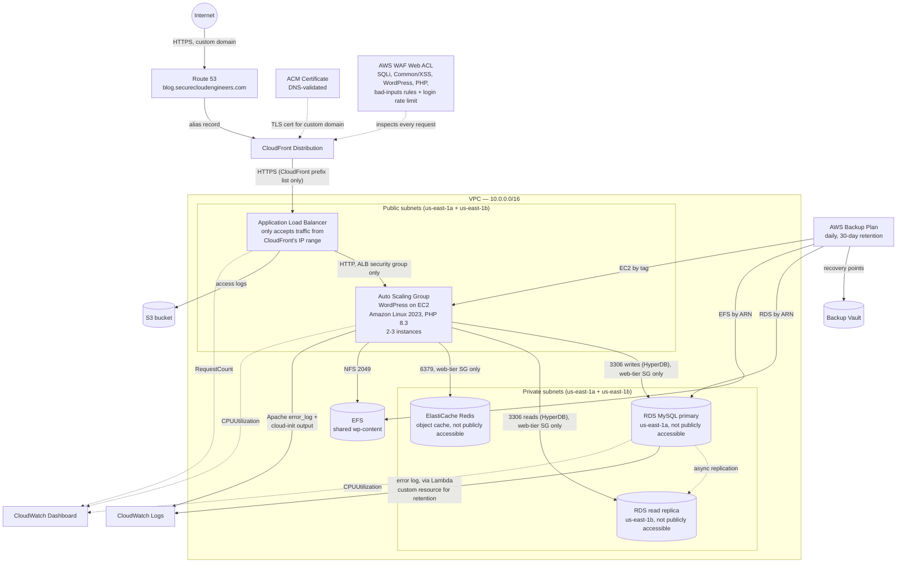
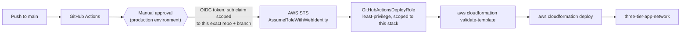

# Three-Tier WordPress on AWS

[](https://github.com/bdahiya2007/three-tier-web-app-aws/actions/workflows/deploy.yml)

A production-style three-tier web architecture on AWS — WordPress running behind CloudFront (on a custom domain, `blog.securecloudengineers.com`, with a DNS-validated ACM certificate) and a dedicated WAF Web ACL, on a horizontally-scaled, self-healing web tier that isn't even reachable except through that edge layer, backed by a database that's never directly reachable, splits reads across a cross-AZ read replica, and is shielded from repeat reads by a Redis object cache, with shared state, a daily AWS Backup plan (30-day retention) covering the database, shared storage, and the web tier, full observability, a CI/CD pipeline authenticated via GitHub OIDC (no long-lived AWS credentials), and a documented security review. Not persistently hosted — a public WordPress admin login isn't something worth leaving exposed indefinitely for a demo. Deployable on demand; see [Deploying this yourself](#deploying-this-yourself).

## What this demonstrates

- Designing a three-tier architecture where the data tier (RDS) is never publicly reachable — only the web tier's security group can reach it, on the database port, nothing else
- Making a considered build-vs-reuse call on a pre-existing WAF Web ACL from another project in the same account: identifying that reusing it would create cross-stack ownership conflicts and only covers half the requirement (SQLi, not XSS), then building a dedicated one instead of forcing a reuse that looked convenient but wasn't sound
- Actually closing the bypass a WAF alone doesn't: restricting the ALB's security group to CloudFront's own IP range (an AWS-managed prefix list), since a WAF attached only to CloudFront does nothing if the origin behind it is still directly reachable from the internet
- Adding a custom domain (`blog.securecloudengineers.com`) with a DNS-validated ACM certificate and a Route 53 record into a hosted zone owned by a *different* project's stack — as a new record, not a modification of that zone's existing records, so it doesn't create the same cross-stack ownership conflict a shared WAF Web ACL would have
- Building for horizontal scale and resilience: an Auto Scaling Group (2-3 instances) across two Availability Zones behind an Application Load Balancer, with shared state (EFS) so any instance can serve any request identically
- Read/write splitting with a cross-AZ RDS read replica and the HyperDB drop-in — and *proving* it, not just configuring it: measured live `Com_select` counters to confirm reads actually hit the replica (+399 vs. +1 background noise across 15 requests), then confirmed a real WordPress write succeeds only because it reaches the primary, by separately proving a direct write against the replica fails (`read_only` enforced)
- Adding a Redis object cache (ElastiCache) as a WordPress drop-in (`object-cache.php`) instead of just configuring the connection and hoping — installed the native PhpRedis PHP extension for real performance, and verified `DBSIZE`/key contents directly against Redis after real traffic, not just that the plugin files existed
- Centralizing disaster recovery with a single AWS Backup plan across three different resource types (RDS, EFS, EC2), each selected the right way for what it actually is — RDS/EFS by explicit ARN (fixed, known resources), EC2 by tag (ASG-managed, instances get replaced) — then triggering real on-demand backup jobs to prove the vault/IAM role/selection actually work, catching an RDS-specific reporting quirk (`BackupSizeInBytes: 0` on a genuinely complete snapshot) along the way instead of mistaking it for a failure
- Fixing a WAF false positive precisely instead of broadly: when `CrossSiteScripting_BODY` started blocking legitimate WordPress content edits (`style="..."` in the block editor's own markup), the fix wasn't to disable XSS-body detection — it was a scoped custom rule that re-blocks it everywhere except the specific REST API path that needs the exception, verified by confirming the same payload is still blocked on every other endpoint
- Recovering from a real failure end-to-end: restoring RDS from a snapshot after the original stack was deliberately deleted, including the specific quirks of a MySQL snapshot restore (`DBName` rejected by the API, master password never carried over from a snapshot)
- Instrumenting the stack for observability: a CloudWatch dashboard (EC2/RDS CPU, ALB request count) plus a full logging pipeline — ALB access logs to S3, instance and RDS logs to CloudWatch Logs — with cost-conscious, centrally-configured retention
- Solving a CloudFormation/RDS ownership conflict (RDS auto-creates its own log group; a plain `AWS::Logs::LogGroup` resource would race it) with a small Lambda-backed custom resource, instead of reaching for a workaround that risks replacing the live database
- Replacing long-lived AWS credentials with GitHub OIDC role assumption — including tracking down the real cause of a failed `AssumeRoleWithWebIdentity` call via CloudTrail (GitHub's `sub` claim embeds immutable numeric org/repo IDs, not just names)
- Writing a least-privilege IAM policy for the CI role: scoped to this stack's specific resource ARNs wherever AWS's IAM model supports it, and to a tight action list (not `service:*`) where it doesn't
- Closing a real gap found in a security review: merging to `main` was the only thing standing between a PR and a live AWS deploy. Added a GitHub Environment-based manual approval gate in front of `deploy.yml` — configured via the API since protection rules aren't expressible in workflow YAML — so shipping is now a deliberate second step, not an automatic side effect of merging
- Hitting a real AWS quota mid-rollout (a security-group rule limit, from a 46-entry AWS-managed prefix list) while encrypting CloudFront-to-ALB traffic, and recovering correctly: identified that CloudFormation's own create-before-delete resource-swap ordering needed 92 rule slots against a 60 limit even though neither the before nor after state ever needed more than 46, then fixed it with a targeted manual step instead of a broader (and more expensive) quota increase request
- Learning the hard way that "deployed live" and "merged" are different completion states: applying an urgent fix directly to a live stack, then leaving its branch unmerged, meant the next *unrelated* deploy used the stale `main` template and tried to undo the fix — caught and fixed by treating a clean, no-diff change-set against the live stack as the actual proof of "done," not just a successful manual deploy
- Finding that documented guidance and actual deployed state aren't the same thing: a security review caught `SSHLocationCidr` still at its permissive `0.0.0.0/0` default on the live stack, despite this file already documenting the fix — closed with a live, parameter-only update (no template change, since the permissive default is still correct for a fresh deploy) and verified directly against the security group afterward, not just assumed from the change-set succeeding
- Diagnosing an unexpected RDS bill from first principles: an AWS Billing chart showing a disproportionate charge for two brand-new, tiny database instances turned out to be RDS's Extended Support surcharge for a MySQL major version that had quietly exited standard support — found by cross-referencing the account's actual engine version and AWS's published per-vCPU-hour rate, not by guessing, then fixed with an in-place major-version upgrade and hitting (then solving) a real CloudFormation/RDS ordering conflict between the primary and its read replica along the way
- Running a security architect review that found and fixed a real input-validation gap (see [Security review](#security-review) below) rather than declaring victory once the feature merely deployed without errors
- Enforcing the branch/PR policy at the platform level, not just by convention: a branch protection rule on `main` rejects direct pushes outright and requires the CI lint check to pass and the branch to be up to date before merge is even possible — configured to still let a solo maintainer merge their own reviewed PRs (`required_approving_review_count: 0`) rather than accidentally locking the repo owner out
- A second, stack-wide security review that found issues hiding in plain sight: the DB master password was being written to CloudWatch Logs by `bash -x` tracing in `UserData` (confirmed by counting matching log events, never printing them), and the CI deploy role could grant *itself* admin, because a role that deploys its own permissions can always escalate them. Fixed the second one structurally rather than with tighter conditions: the role moved to a separate, manually deployed stack with an explicit self-Deny, and a permissions boundary caps every role it can grant to
- Outgrowing CloudFormation's 51,200-byte inline template limit (hit twice: a 3-line fix passed `cfn-lint`, merged, then failed on deploy) and fixing it properly: deploys now go through a stack-owned S3 bucket (1 MB limit), with a PR-time size check so the next overflow fails before merge, not after
- Documenting every failure encountered as it happened — root cause and fix, not just the happy path — in [Deployment.md](Deployment.md)

## Architecture





## Why this architecture

| Decision | Reasoning |
|---|---|
| RDS in private subnets, `PubliclyAccessible: false`, security group only accepts 3306 from the web tier's security group | The database is never directly reachable from the internet — only the WordPress instances can reach it, and only on the DB port |
| WordPress instances live in **public** subnets (no NAT Gateway) | Avoids the recurring cost of a NAT Gateway for a portfolio project, while `WebServerSecurityGroup` still only accepts HTTP from the ALB's security group, not the internet directly — the only direct path in is SSH, gated by `SSHLocationCidr` |
| A second private *and* second public subnet, in a second AZ | RDS requires a DB subnet group spanning ≥2 AZs even for a single-AZ instance; the ALB and Auto Scaling Group then reuse that same second AZ's public subnet for genuine multi-AZ availability, instead of adding a third subnet just to satisfy RDS |
| EFS mounted at `wp-content` only, not the whole webroot | WordPress core files are cheap to reinstall per-instance from the official tarball at boot; only `wp-content` (themes/plugins/uploads) needs to be shared across instances, so only that path depends on network storage |
| First-boot EFS seeding is conditional (copies local `wp-content` to EFS only if EFS is still empty) | The same `UserData` script has to be correct whether an instance is the very first one ever, or the fifth replacement joining an already-populated Auto Scaling Group |
| RDS log retention set via a Lambda-backed custom resource, not a plain `AWS::Logs::LogGroup` | RDS auto-creates its own log group when `EnableCloudwatchLogsExports` is set; a CloudFormation-managed log group with the same name would race it and fail with "already exists." The alternative — giving `DBInstance` an explicit `DBInstanceIdentifier` so the log group's name could be known in advance — is an immutable, replacement-triggering property; not worth risking the live database over log retention |
| GitHub Actions authenticates via OIDC role assumption, not access keys | No long-lived AWS credentials stored in GitHub at all. The trust policy checks the token's `sub` claim — including GitHub's immutable numeric org/repo IDs, not just the names — against this exact repository and branch |
| CI role's IAM policy: tight action lists on `Resource: "*"` for most infrastructure services, ARN-scoped for IAM, S3, and Route 53 | Most EC2/RDS/ELB/EFS/Lambda create-and-describe actions don't support resource-level ARN restriction in AWS's own IAM model — scope is enforced via the action list instead. Route 53 record actions *do* support it, so the policy restricts them to just the one hosted zone this stack adds a record into, not every zone in the account. IAM permissions are the tightest of all, since over-broad IAM permissions on a CI role is a privilege-escalation risk |
| Snapshot restore is parameter-driven (`DBSnapshotIdentifier`), not a separate template | The same template can either create a fresh database or restore a prior one, decided at deploy time — used for real after the stack was deliberately deleted and needed its WordPress content back |
| A new, dedicated WAF Web ACL, not the one already in this account from another project | The existing ACL only covers SQLi (not XSS) and is owned by an independent CloudFormation stack — importing or modifying it would mean two unrelated stacks fighting over its rule list on every future update, and would couple this project's security posture to an unrelated site's |
| ALB security group restricted to CloudFront's IP range (AWS-managed prefix list), not `0.0.0.0/0` | A WAF attached only to CloudFront protects nothing if the origin behind it is still directly reachable — this is what actually makes the WAF's protection real instead of bypassable |
| `SizeRestrictions_BODY` overridden to `Count`, paired with raising the Web ACL's body inspection limit to 64 KB | The managed rule's hardcoded 8 KB threshold was blocking real WordPress posts, not just attacks — it has no content awareness and no tunable size. Countering it alone would leave the actual SQLi/XSS rules blind past the first 8 KB of any request; raising the inspection limit alongside it keeps full-body detection intact while fixing the false positive |
| `CrossSiteScripting_BODY` overridden to `Count`, then re-blocked by a custom rule scoped to everywhere *except* the WordPress REST API path | Unlike `SizeRestrictions_BODY`, this rule is an actual content-safety signal, so a blanket override would be a real reduction in protection. A label-based custom rule (`BlockXSSBodyExceptRestApi`) re-blocks any request still carrying the CRS's own XSS-body label, except on `/wp-json/wp/v2/*` — the one path where WordPress's own generated markup (`style="..."` attributes) routinely looks like the pattern this rule matches |
| Custom domain's Route 53 record added into an existing hosted zone owned by a different stack, rather than that zone being imported/owned here | `AWS::Route53::RecordSet` is its own independent resource, unlike a Web ACL's `Rules` list — adding one new record doesn't create the "whole list is authoritative" conflict a shared WAF ACL would, so there's no reason to duplicate or migrate the zone itself just to add one subdomain |
| CloudFront caching disabled (`CachingDisabled` + `AllViewerAndCloudFrontHeaders-2022-06` policies) rather than enabled by default | WordPress is a dynamic, session-aware application; caching GET responses at the edge risks serving one visitor's logged-in page to another. CloudFront here is a TLS-termination + WAF-enforcement layer, not a performance cache — real caching for static paths would be a deliberate follow-up, not a default |
| Origin request policy forwards CloudFront's own `CloudFront-*` headers, not just viewer headers | With an HTTP-only ALB origin, the ALB's own `X-Forwarded-Proto` always reads `http` (it reflects the CloudFront-to-ALB hop, not what the viewer actually used), which sent WordPress into an infinite redirect loop on `/wp-admin`. `CloudFront-Forwarded-Proto` carries the viewer's real protocol, but only reaches the origin if the origin request policy explicitly opts into CloudFront's headers — plain `AllViewer` doesn't |
| Read replica placed via an explicit `AvailabilityZone`, reusing the same security group as the primary | A different AZ than the primary gives it independent power/network/hardware fault domains; sharing the primary's security group is a deliberate simplification since both serve the identical consumer (the web tier) with the identical access pattern — no reason to duplicate the rule set |
| Read/write splitting via HyperDB (a WordPress drop-in) rather than at the infrastructure layer (e.g. a proxy) | WordPress core has no native concept of a read replica — every query goes wherever `DB_HOST` points. HyperDB intercepts at the `wpdb` layer instead, which is the standard, Automattic-maintained way to do this for WordPress specifically, rather than introducing a separate proxy component (e.g. ProxySQL) this project doesn't otherwise need |
| Redis object cache via a drop-in (`object-cache.php`), same mechanism as HyperDB | WordPress has no built-in persistent object cache. A drop-in is what the plugin's own "Enable Object Cache" button does, just automated in `UserData` — no wp-admin click required at boot. Single-node, no Multi-AZ: cache data is disposable (rebuilt from RDS on the next read), so there's nothing worth the extra cost or complexity of protecting through a node failure |
| Native PhpRedis PHP extension installed, not left to the plugin's bundled pure-PHP Predis fallback | The plugin works either way, but PhpRedis is meaningfully faster — checked that Amazon Linux 2023's `php8.3-pecl-redis6` package actually exists before assuming it, rather than guessing at a package name |
| AWS Backup selects RDS/EFS by explicit ARN but EC2 by tag, not the same mechanism for all three | RDS and EFS are single, fixed resources with known ARNs. EC2 instances are ASG-managed and get replaced over time — a static ARN would silently stop covering new instances, while tag-based selection (the `Name` tag the ASG already propagates at launch) keeps working automatically |
| The RDS read replica is deliberately excluded from the backup plan | It's derived entirely from the primary via replication, not independent data — restoring it on its own doesn't make sense; recovering the primary and re-creating a replica from it does |
| ASG has an `UpdatePolicy` (`AutoScalingRollingUpdate`) instead of relying on manual instance refreshes | A launch template change previously sat inert on already-running instances until someone remembered to trigger a refresh by hand — real unpatched-instance risk. `MinInstancesInService` matched to `AsgMinSize` (one below `AsgMaxSize`) means the rolling replacement never dips below the minimum, trading the old manual safety pause for CloudFormation's own rollback-on-failed-health-check behavior |
| Deploy workflow pauses for manual approval (a GitHub Environment) before touching AWS, on top of branch protection | Branch protection gates what can reach `main`; nothing previously gated the moment `main` actually gets deployed — merging *was* deploying. The environment's required reviewer is configured via the GitHub API, not a file in this repo, since protection rules aren't expressible in workflow YAML |
| CloudFront-to-ALB traffic is HTTPS, not plain HTTP, reusing the existing custom-domain certificate rather than issuing a new one | Visitor traffic was already encrypted end-to-end to CloudFront, but the CloudFront-to-origin hop inside AWS's own network wasn't. The old HTTP listener was removed entirely rather than kept as a redirect, since CloudFront's `https-only` origin policy means nothing will ever send it a port-80 request regardless — and removing it was also required to stay under a real security-group rule quota (see below) |
| The old HTTP-only ALB listener/security-group rule was deleted outright, not converted to an HTTPS redirect | The CloudFront origin-facing prefix list has 46 entries, and each security-group rule referencing it consumes 46 rule slots against a 60-per-group quota — keeping both an HTTP and HTTPS CloudFront-facing rule simultaneously (92 slots) isn't possible without a quota increase. A manual out-of-band fix (revoking the old rule before redeploying) was needed since CloudFormation's own create-before-delete ordering hit the same limit mid-update |
| MySQL upgraded from 8.0 to 8.4 (LTS), not just left on 8.0 | 8.0 quietly exited AWS/Oracle standard support, triggering a per-vCPU-hour Extended Support surcharge that bills continuously regardless of how small or new the database is - 8.4 has no such surcharge. The read replica had to be upgraded to 8.4 *before* the primary, out-of-band via the RDS API directly - CloudFormation's own dependency graph (`DBReadReplica` depends on `DBInstance`) always processes the primary first, which RDS's own major-version-upgrade API rejects when an old-version replica still exists |
| Deploys will upload the template to an S3 bucket the stack owns (`CfnArtifactsBucket`) instead of sending it inline | Inline `TemplateBody` is capped at 51,200 bytes, and this template reached that limit twice. The bucket is part of the stack and auto-named inside the deploy role's existing S3 scope, so the role only needed object-level permissions added, not access to anything new |
| The CI deploy role lives in its own manually deployed stack (`pipeline.yaml`), not in the stack it deploys | A role that deploys its own permissions can always escalate them. Moving it out, adding an explicit self-Deny, and requiring a permissions boundary on every role it grants to means a compromised workflow run is capped at the app's own permissions, not account admin |
| DB password read from Secrets Manager at runtime (1-minute refresh timer), not baked into `UserData` | A security review found the password in CloudWatch Logs and in every launch template version. A runtime fetch removes it from both, and the refresh timer means a rotation reaches running instances in about a minute instead of needing a 20-minute rolling replacement. The secret was seeded with the existing password first, so the switch itself caused no downtime |
| `DBPassword`'s `AllowedPattern` excluded `'` and `\`, not just `/`, `@`, `"`, and whitespace (the parameter has since been removed: the generated password in Secrets Manager excludes the same characters) | Found during a security review: `db-config.php` embeds the password inside a single-quoted PHP string literal, so an unescaped `'` in a chosen password would cause a fatal PHP parse error on every instance boot — a self-inflicted outage from an otherwise-valid password. The older `wp-config.php` `sed` substitution wasn't vulnerable to this specific character |

## Security review

Adding the RDS read replica was followed by a dedicated security/architecture review — auditing both the CloudFormation code and the live deployed state, then proving behavior empirically rather than trusting that "it deployed without errors" means "it works correctly."

**Verified, with evidence, not just configuration:**
- Replica confirmed in a different AZ than the primary; both instances `PubliclyAccessible: false`; both DB subnets' route tables have only a local VPC route — no gateway path at all, confirmed at the routing layer, not just the API flag
- Security group scoped to TCP 3306 from the web tier's security group only, shared correctly by both instances
- **Reads actually reach the replica**: measured `SHOW GLOBAL STATUS` `Com_select` before/after 15 page loads — replica +399, primary +1 (background noise)
- **Writes actually reach the primary**: ran a real `$wpdb->query()` INSERT through the live HyperDB code path (succeeded, no error), then separately confirmed a *direct* write attempt against the replica fails outright (`read_only` enforced) — proving the first write couldn't have landed there
- The replica's `read_only` enforcement acts as a fail-safe independent of HyperDB's own config: even a HyperDB misconfiguration couldn't cause a silent write to the replica; it would error loudly instead

**Found and fixed**:
- The ALB accepted traffic from *any* CloudFront distribution, because the origin-facing prefix list covers all of CloudFront. So someone else's distribution could reach WordPress without this stack's WAF. CloudFront now sends a secret `X-Origin-Verify` header (from Secrets Manager), and the ALB returns 403 without it. It was rolled out in two deploys (send first, enforce second), using two ordered listener rules instead of a default-action flip that would have briefly 403'd the whole site.
- The WAF had no rate limiting, no WordPress/PHP rules and no logging, and its REST-API XSS exemption matched `/wp-json/wp/v2/` *anywhere* in the path. Added a per-IP rate limit on `wp-login.php`/`xmlrpc.php`, three more managed rule groups (in Count mode first), logging with cookie/authorization headers redacted, and two exact path prefixes for the exemption. A single prefix would have broken every editor save, because this install's REST API lives under `/index.php/wp-json/`. RDS deletion protection is now on for both instances.
- `DBPassword`'s `AllowedPattern` didn't exclude `'` or `\`, which could break `db-config.php`'s PHP string literal and take the site down on a future password rotation — see the table above.
- The DB master password was leaking into CloudWatch Logs: `UserData` runs under `bash -x`, which echoed the `sed` line writing the password into `wp-config.php` into `cloud-init-output.log` — a log group the CloudWatch agent ships off-instance. Confirmed on the live stack by counting matching log events (without printing them), fixed by disabling tracing around the credential lines. The fix only stopped new leaks, so the password itself was treated as exposed. It then moved to Secrets Manager (read at runtime, out of `UserData` entirely) and was rotated to a generated value, so the leaked one no longer works. The first rotation, done through CloudFormation, quietly left RDS on a different password than the secret. The Redis object cache kept the site looking healthy until a real login failed about 45 minutes later. It was caught with a direct MySQL login from an instance and fixed, and the verification now always uses a real login — see [Deployment.md](Deployment.md#the-db-password-used-to-leak-into-the-cloud-init-log).
- The CI deploy role could grant itself admin: its IAM permissions covered `role/three-tier-app-*`, which matched its own name, because it had to update its own policy through CloudFormation. It now lives in a separate, manually deployed `pipeline.yaml` stack with an explicit self-Deny. Any IAM grant it makes has to carry a permissions boundary that caps the result at the app's own needs — see [Deployment.md](Deployment.md#why-the-deploy-role-lives-in-its-own-stack). Verified with `iam simulate-principal-policy` against the live role: modifying itself or removing a boundary is an explicit deny. The first deploy after the move failed on a duplicate backup selection, and its rollback then got stuck, because the same Deny also blocks CloudFormation from *undoing* a boundary. Recovered with an admin `continue-update-rollback --resources-to-skip`, which kept the boundary in place — see [Deployment.md](Deployment.md#first-deploy-after-the-move-two-failures-and-a-stuck-rollback).

**Found, not yet fixed (flagged for a deliberate decision, not an oversight)**:
- Neither RDS instance is encrypted at rest. This predates the replica, but a replica must match its source's encryption status, so the gap is now on two instances instead of one. Remediation requires snapshot → restore-as-encrypted for the primary (a new endpoint, genuinely disruptive) before the replica could be recreated encrypted too.
- No TLS enforcement in transit between WordPress and RDS (`require_secure_transport` unset). Partially mitigated by VPC-level network isolation, but doesn't meet defense-in-depth for data-in-transit on its own.
- Redis has no encryption or AUTH token; RDS has no Multi-AZ; WordPress uses the DB master user. The newer WAF rule groups (WordPress, PHP, known-bad-inputs) run in Count mode until their logs are reviewed for false positives.
- Accepted rather than planned: web servers in public subnets (a NAT Gateway would roughly double the running cost).

The complete list, with verification commands and planned fixes, is in [Deployment.md](Deployment.md#known-security-gaps-not-yet-remediated--flagged-for-a-decision-not-overlooked).

Full methodology (exact commands, the counter values, the `read_only` proof) is in [Deployment.md](Deployment.md#rds-read-replica-and-wordpress-readwrite-splitting).

## Repository structure

```
.
├── cloudformation/
│   ├── vpc.yaml                  # VPC, ALB + Auto Scaling Group, RDS primary + read replica, EFS,
│   │                              # CloudWatch dashboard, logging (S3 + CloudWatch Logs)
│   └── pipeline.yaml             # GitHub OIDC deploy role, Backup service role, permissions boundary
│                                  # (deployed manually by an admin, never by CI)
├── terraform/                    # Earlier, simpler baseline (see note below) — not feature-equivalent
├── .github/workflows/deploy.yml  # CI/CD: GitHub OIDC authentication, deploy on push to main
├── Deployment.md                 # Full deployment guide, every parameter, and an extensive
│                                  # troubleshooting log of every real failure hit building this
└── .gitignore
```

### A note on the `terraform/` directory

It's an earlier, deliberately simpler snapshot of this project — a VPC, a single EC2 instance, and RDS — predating the Auto Scaling Group, ALB, EFS, CloudWatch dashboard, logging, and CI/CD that the CloudFormation template now has. It's included to show the same core network/database pattern in a second tool, not as a feature-equivalent alternative deployment path. See [terraform/README.md](terraform/README.md) for its own scope and deployment instructions.

## CI/CD pipeline

Two separate workflows, split by trigger — each with its own concurrency scope, so a PR's lint check never has to queue behind an in-progress production deploy:

- [`.github/workflows/validate.yml`](.github/workflows/validate.yml) — every pull request targeting `main`. Lints the CloudFormation template with `cfn-lint` and fails if it exceeds CloudFormation's 1 MB template limit (which `cfn-lint` doesn't check). No AWS credentials at all.
- [`.github/workflows/deploy.yml`](.github/workflows/deploy.yml) — every push to `main` (i.e. after a PR merges). Requests a short-lived GitHub OIDC token, assumes `GitHubActionsDeployRole` (no `AWS_ACCESS_KEY_ID`/`AWS_SECRET_ACCESS_KEY` anywhere in this repo), uploads the template to the stack's own S3 bucket (templates passed inline are capped at 51,200 bytes, which this one outgrew), validates and deploys the stack from there (`KeyPairName` from GitHub Secrets; the DB password is generated in Secrets Manager and never passes through CI; every other parameter keeps its current value), then prints the stack outputs.

Merging into `main` is the actual gate, and it's enforced by a **branch protection rule**, not just convention: direct pushes to `main` are rejected outright, the `validate` check must pass before merge is even possible, and the branch must be up to date with `main` first — the last one specifically closes a real gap this project hit once already (two PRs merging out of order, based on a `main` that had already moved, produced a conflict that also silently stopped CI from re-triggering on the second PR until it was rebased).

Getting the OIDC piece working for real surfaced two failures worth calling out: the trust policy initially checked the `sub` claim in the wrong format (missing GitHub's immutable numeric org/repo IDs — found by reading the actual denied request out of CloudTrail, since workflow logs never show token contents), and the IAM policy was initially missing `cloudformation:GetTemplateSummary`, a permission `aws cloudformation deploy` needs internally that isn't part of the change-set API surface its name suggests. Both — plus the full branch protection configuration and the cfn-lint findings hit along the way — are documented in detail, with the exact diagnostic commands used, in [Deployment.md](Deployment.md#troubleshooting).

## Deploying this yourself

See [Deployment.md](Deployment.md) for the full guide — every parameter, the GitHub Actions/OIDC one-time setup, connecting to the database, viewing logs and the dashboard, and the full troubleshooting log. Quick version:

```bash
# 1. Pipeline stack first (deploy role, Backup role, permissions boundary) - the app stack imports its exports
aws cloudformation deploy \
  --template-file cloudformation/pipeline.yaml \
  --stack-name three-tier-app-pipeline \
  --region us-east-1 \
  --capabilities CAPABILITY_NAMED_IAM \
  --parameter-overrides GitHubRepo=<your-repo-name> GitHubRepoId=<your-repo-id>

# 2. Then the app stack (over the 51,200-byte inline limit, so --s3-bucket is required;
#    on a first deploy use any bucket you own - CI later uses the stack's own bucket)
aws cloudformation deploy \
  --template-file cloudformation/vpc.yaml \
  --s3-bucket <an-existing-bucket-you-own> \
  --stack-name three-tier-app-network \
  --region us-east-1 \
  --capabilities CAPABILITY_NAMED_IAM \
  --parameter-overrides \
    KeyPairName=<your-existing-ec2-key-pair-name>
```

**Idle cost control:** `scripts/stack.sh down` deletes the app stack with one command, keeping the database as a final snapshot, and `scripts/stack.sh up` rebuilds it from that snapshot. See [Deployment.md](Deployment.md#tear-down-and-rebuild-cost-saving).

## Tech stack

AWS CloudFormation · Amazon CloudFront · AWS WAF (managed rule groups) · Amazon Route 53 · AWS Certificate Manager (DNS validation) · Amazon VPC · Amazon EC2 (Auto Scaling, Launch Templates) · Elastic Load Balancing (Application Load Balancer) · Amazon RDS (MySQL, read replica) · HyperDB (WordPress read/write DB splitting) · Amazon ElastiCache (Redis) · AWS Secrets Manager · Redis Object Cache (WordPress drop-in) · Amazon EFS · AWS Backup · AWS Lambda (custom resource) · Amazon CloudWatch (Dashboards, Logs) · AWS IAM (OIDC federation) · Amazon S3 · Amazon Linux 2023 · PHP 8.3 · Apache · WordPress · Terraform (baseline alternate path) · GitHub Actions
